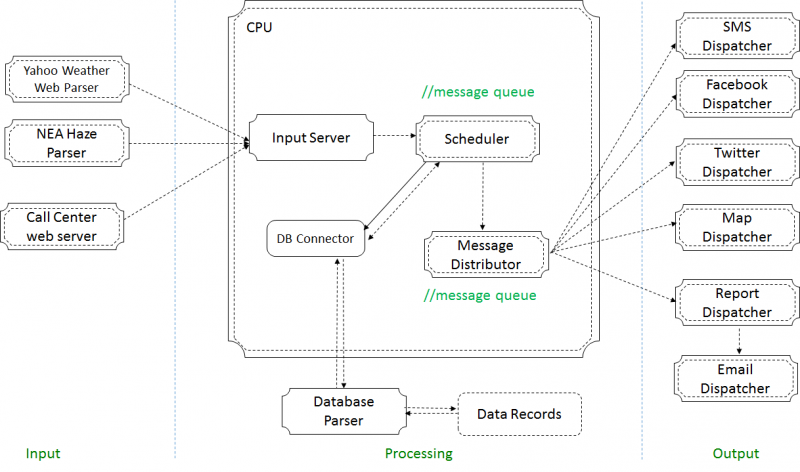

Legacy Series: Software Architecture Analysis
============
General Info
------------
Crisis Management System (CMS)  
Integration of:
* Call Center Web Portal
* Facebook API
* Twitter API
* Google Map
* Core Engine (Central Processor)
* SMS API
* Report generator and email distributor
* Postgre Database
* Weather & Haze Information Parser

Purpose of this code
------------
One senior's legacy for the adorable juniors.  

###Contributors
QUEK TENG YEOW  Project Manager  
TEO KOK HIEN  QA Manager  
ZHANG DANYANG  Lead Developer  
QUEK JIAN HONG JOEL  Lead Architect  
GOH ZHILING CYNTHIA  Developer  
MANISHA ARVIND SURYAVANSHI  Analyst  
NEO YONG KWANG SUNNY  Lead Tester  
YANG WANGQING  Quality Controller  
WANG YICHEN  Architect  
ZHANG ZHUZHEFU  Architect  
